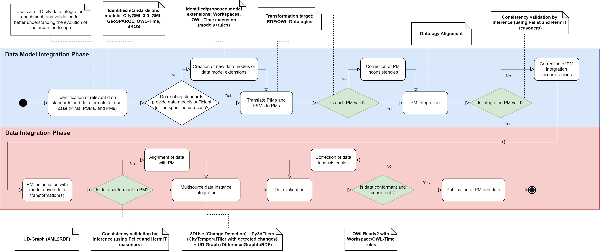

## Gratte Ciel 2009-2018 Workspace
A set of RDF datasets of the Gratte Ciel neigborhood of the Villurbanne commune in France.

These data are structured and validated according to the CityGML model and the CityGML Workspace extension proposed in
> [1] J. Samuel, S. Servigne, and G. Gesquière, “Representation of concurrent points of view of urban changes for city models,” J Geogr Syst, vol. 22, no. 3, pp. 335–359, Jul. 2020, doi: 10.1007/s10109-020-00319-1.

These RDF datasets were produced using the following methodology:

Supplementary methodology activity notes:
- This approach was implemented twice, once using CityGML 2.0 and again with CityGML 3.0.
- PSM to PM transformation was executed using the ShapeChange and the ShapeChange configuration files located [here](../../Transformations/ShapeChange/) to transform CityGML and the Workspace ADE to OWL/RDF
- The produced OWL ontologies are located [here](../../Ontologies/) including proposed alignements between CityGML and GeoSPARQL and ISO 19136 (GML)
- The [XML2RDF](../../Transformations/XML-to-RDF/) Transformation tool was used to instantiate the network of ontologies with the proposed ontology network and [versions of the Gratte Ciel neighborhood in CityGML](https://partage.liris.cnrs.fr/index.php/s/jArrjsJxzsC5YAg).
  - To transform CityGML data the following ontology networks were passed to XML2RDF:
    - [CityGML 2.0 or 3.0](../../Ontologies/CityGML/)
    - [SKOS](https://www.w3.org/2009/08/skos-reference/skos.rdf)
    - [GeoSPARQL](http://www.opengis.net/ont/geosparql#)
    - [GML](http://www.opengis.net/ont/gml#)
    - [ISO 19136 Features](https://def.isotc211.org/ontologies/iso19136/2007/Feature.rdf)
    - [ISO 19107 Coordinate Geometry](https://def.isotc211.org/ontologies/iso19107/2003/CoordinateGeometry.rdf)
    - [CityGML, GeoSPARQL, and ISO 19136 Alignments](../../Ontologies/Alignments/)  
  - VersionTransitions were calculated using [cityGMLto3DTiles](https://github.com/VCityTeam/cityGMLto3DTiles) and the [DifferenceGraph2RDF](../../Transformations/DifferenceGraph-to-CityGML3/) script.
  - Bitemporal timestamps were added to the city features, and Versions using the [AddTimeStamps.py](../../Transformations/utilities/AddTimeStamps.py) utility script as these datasets originally do not include any temporal information. Timestamps were added using the following properties were added.
    - From [OWL-Time](http://www.w3.org/2006/time#), `#hasTime`
    - From the proposed [OWL-Time extension](../../Ontologies/Time/time-extension.ttl), `#hasExistenceTime`
    - From CityGML 2.0 `core:AbstractFeature.creationDate` and `core:AbstractFeature.terminationDate`
    - From CityGML 3.0 `core:AbstractFeatureWithLifespan.validFrom` and `core:AbstractFeatureWithLifespan.validTo`
  - Workspace, Space, and Scenario data was instantiated manually.
- The Proof of concept SWRL rules test suite proposed [here](../../rules/) was used to validate the CityGML 3.0 workspace for consistency using the SWRL rules proposed [here](../../rules/rules.json)
  - Note that these rules use the previously declared bitemporal timestamps added to the data to determine if features are also temporally consistent   
  - The tests effectuated are defined [here](../../rules/workspace_tests.json). Due to memory limitations, the entire workspace could not validated at once. Thus far the first two versions and corresponding transition of each scenario of the workspace have been tested.
  - Rules are currently being written for CityGML 2.0

This approach is currently being dockerized in [UD-Reproducibility](https://github.com/VCityTeam/UD-Reproducibility) as a transformation pipeline using the [UD-Graph-docker](https://github.com/VCityTeam/UD-Graph-docker) container