# Geospatial urban data and the semantic web: From representation to proof of concept

## Acknowledgements

I would like to thank my internship supervisors, John Samuel, Gilles Gesquiére, and Sylvie Servigne for their incredible direction and support throughout this project, as well as the Virtual City Team – especially Eric Boix – for their valued advice. I am also grateful to my professor, Ernesto Exposito, for his encouraging guidance. In addition, I would like to thank Jean-Michel Deleuil for introducing me to LIRIS and his family for their warm hospitality and care throughout the pandemic. And finally, my parents for their loving support.

## Table of Contents

1. **Foreword**
2. **Introduction**
   1. _General Context_
   2. _Urban Data Within Graphs and Ontologies_
3. **State of the Art**
   1. _Data Conversion Techniques_
   2. _Ontology Generation Approaches_
   3. _Existing Ontologies and Query Frameworks_
   4. _Synthesis of Works_
4. **From CityGML Urban Data to Linked Data: A Proposed Approach**
   1. _Approach Structure and Design_
   2. _Transforming CityGML Instances into RDF_
   3. _Generating a CityGML Ontology from XML Schema_
   4. _Integrating GeoSPARQL_
5. **Results**
   1. _"CityOWL" Ontology_
   2. _Generated Dataset_
   3. _Query Results_
6. **Conclusion and Future Work**
   1. _Synthesis of Contribution_
   2. _Perspectives_
   3. _Professional and Personal Assessment_
7. **References**

## 1. Foreward

This report is the product of a 6-month internship held between March 1st and August 31st, 2020 within the research unit (CNRS UMR 5205) LIRIS, Laboratoire d&#39;InfoRmatique en Image et Systèmes d&#39;information, as a subproject of the Virtual City Project. Within this context, it comprises part of a transversal effort between the _Database_ (BD), Origami and _Graphs, AlgOrithms, and AppLications_ (GOAL) team in exploring RDF data generation and graph compression. This internship took place in the Nautibus laboratory of the Claude Bernard University Lyon 1 until March 16th where it was moved to a teleworking environment for the remainder of the project. Development was done on a personal laptop and a provisioned desktop computer. Weekly meetings were held with supervisors to update status of the project, provide feedback, and evaluate immediate and future objectives, both in person and though video-conferencing software when appropriate. In addition, weekly team meetings were held to provide status updates on team members, team projects, and share ideas.

## 2. Introduction

Urban environments are naturally complex and heterogeneous sources of information. The data they generate, these "geospatial" urban data, can take many forms, descriptions, and may follow many different standard formats. The data presented in these formats are generally incompatible with each other and cannot always be easily queried. This poses a problem for researchers, historians, and city planners – among many other stakeholders – as it becomes difficult to take all the available data into account without conversion or making several, distinct queries in separate databases.

It is critical for these groups to understand what this information represents and how it inter-relates among itself. Observing these relationships and how they evolved over time can give a more detailed view of how the past decisions of city planners impacted cities historically and in the present, which in turn allows more informed decision making about planning and developing cities for the future.

Is there a way to link and query these various forms of urban data side-by-side, and if yes, how can we accomplish this? What do we precisely gain from this representation? And what are the limitations of the format?

### 2.1. General Context

Geospatial urban data or multi-dimensional urban data, as they contain a locational or spatial context, fall under many types of representations and visualizations. Multi-dimensional urban data are sometimes referred to as n-D or n-dimensional data, as they can be represented in 2D (floorplans, satellite imagery), 3D (CAD models, terrain topology), with thematic and additional information such as administrative documents, sketches, and articles, and temporally as they change over time. In recent years, many different formats have seen a rise in use to model, store, and visualize this broad type of urban information. Spatial Data Infrastructures (SDI) can provide standardized frameworks for structuring and sharing geospatial data [1], Geographic Information Systems (GIS) and Building Information Models (BIM) provide tools and models for the analysis and capture of 3D and geospatial data [2]. The Open Geospatial Consortium (OGC) – an international consortium of more than 500 businesses, government agencies, research organizations, and universities – provides over 60 unique standardized geospatial data formats and frameworks [3]. With such a large volume of methods for serializing urban data, the need to inter-relate this information is ever present to create a more complete representation of the urban landscape.

A possible approach to this problem is to implement semantic web technologies and move multi-dimensional urban data into linked-data models. In order to manipulate an existing body of this data alongside other formats, we propose using a conversion tool to transform the data into a linked data, supported by an ontology, allowing us to take advantage of existing linked data standards and to permit querying this data alongside other linked data. The dataset we propose to convert will be based in CityGML; an XML based SDI extension of GML proposed by the OGC for modeling virtual cities in 3D. Its final representation will be in OWL/RDF; a graph-based ontology language proposed by the World Wide Web Consortium (W3C).

### 2.2. Urban Data Within Graphs and Ontologies

Resource Description Framework (RDF) is a standard model for linked data interchange information on the Web. Its structure consists of sets of assertions called triples. Triples are composed of subjects, predicates, and objects (fig. 1) where the subject is the topic of the assertion, the predicate describes the relationship between the subject and object, and the object is either another subject or a primitive datum such as a string or integer. With this structure, we can create a graph to describe the relationships between points of information by using the subjects and objects as nodes and the predicates as the edges between the nodes.

The semantic web builds on the framework laid out with RDF. RDF Schema (RDFS) and the Web Ontology Language (OWL) allow us to add context to RDF triples. Categories or types of objects are described with _Classes_, their instances are called _Individuals_, their characteristics are called _Datatypes_, and the relationships between all these concepts are called _Properties_ (fig. 2). Although research in implementing this semantic web stack are still ongoing, several research efforts have already been made [1], [2], [4]–[7] in representing geospatial and urban data in linked data and ontological formats. Furthermore, there is an official semantic web resources proposed by the OGC for representing this data: GeoSPARQL – a geospatial ontology and a functional extension to the RDF query language SPARQL. However, none of these approaches provide a semantic representation of CityGML&#39;s features nor a method for converting CityGML features into RDF/OWL.

![CityGML 2.0 Ontology: Geometry Classes and Properties [8]](images/figure2.png)

The SPARQL Protocol and RDF Query Language (SPARQL) is one of, if not, the most common means of querying RDF data. Generally, queries are SQL-like as they utilize SELECT-WHERE statements to extract data from RDF. Queries are formulated in a triple structure - like RDF - with the intention of returning statements that match the patterns denoted in the query. The GeoSPARQL extension to these queries adds spatial functions, such as _geof:sfIntersects_, and _geof:sfOverlaps_, that return datum which satisfy the spatial relations described by these functions, giving us a powerful tool for retrieving and analyzing the CityGML data after conversion.

This report will enumerate the work done by exploring the previously mentioned proposal as follows: Section 3 will provide a description of the state of the art of converting geospatial – and specifically GML/CityGML – data into linked data, and how it can be queried. Section 4 proposes the conception and development of a proof of concept tool to convert CityGML information into linked data and its experimentation during the project. Section 5 will summarize the resulting semantic dataset produced by the tool and the queries utilized in the experimentation of the data. Finally, section 6 will conclude with a synthesis of the results and perspectives gained from the project.

## 3. State of the Art

In order to represent GML and CityGML as linked data, several approaches have been undertaken, including official efforts from the OGC. In general, there are two types of approaches that can facilitate the conversion of CityGML instances into RDF (fig. 3):

1. Direct conversion of GML/CityGML data into RDF.
2. Generation of an RDF graph from CityGML data, based on the rules and structure of the CityGML "conceptual" model.

In addition, several approaches exist for the generation of a supporting CityGML ontology. To explore these avenues, we will look at the differences in data generation with and without using the CityGML model, how existing ontologies could be used to enrich the resulting data, which approaches could be used for the creation of an ontology from GML/CityGML, and finally, what methods exist for the generation and application of spatial queries over the resulting multidimensional dataset.

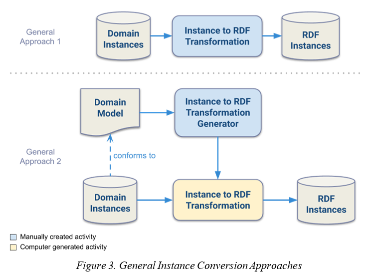

### 3.1. Data Conversion Techniques

There are several tools and techniques for converting GML/CityGML into RDF. Some approaches make use of GML&#39;s origins as an RDF serialization [8], [9] to assume the structure of GML in RDF form. And others make use of CityGML&#39;s application schema as a model to extract semantic information to guide the generation of RDF data from CityGML [10]–[12], some even propose deriving the model from XML instances if the XML schema is unavailable [10]. This section will provide a brief introduction to 4 of these related works as denoted in table 1.

_Table 1. State of the art XML/GML instance conversion approaches_

| Approach name | Author(s) | Approach Type |
| --- | --- | --- |
| XML2OWL [10] | Bohring and Auer | 2 |
| _"Software Tools for XML to OWL Translation"_ [12] | Kramer et al. | 2 |
| GML to RDF [8], [9] | Brink et al. | 1 |
| _"A web-based GML to stRDF / GeoSPARQL conversion tool"_ [13] | Marios S. Bekatoros | 1 |

The first of these approaches explored was by Hannes Bohring and Soren Auer in [10], a proposed framework for converting XML and XML schema to owl facilitated by XSLT. In this approach, it is assumed that there are natural semantic relationships in both XML instances and the XML schema that define them. By extracting or extrapolating these conceptual relationships from the XML, an XML to OWL transformation mapping can be generated, even when the XML schema is not available to guide the generation process. In the case where no XML Schema is available, a preliminary transformation can be made to create an XML schema from implicit structures in the XML data. Once the schema is created, a transformation stylesheet can be generated to facilitate the mapping of XML instances to OWL individuals.

However, as mentioned in the proposal itself, the automatic generation of XML schema from XML instances may be incomplete or insufficient to generate a complete ontology. In addition, providing two different XML instances could create two conflicting instance transformation stylesheets. Unless assumptions can be made about the inherent mapping and relationships of the XML instances to RDF/OWL like in [9], direct XML to RDF conversion without a semantic or information model to draw from may not be possible for CityGML without potentially rendering the resulting RDF instances non interoperable.

The second approach – made by Kramer et al. in [12] in 2015 – describes a comprehensive synthesis of previous XML to OWL translation approaches and proposes a conversion tool that incorporates these techniques. Unlike many of the previous articles, the proposed tool was scripted in C++ over XSLT to improve performance. The paper focuses on general approaches for transforming both XML schema and XML instances into OWL ontologies and OWL individuals respectively in addition to tools for parsing XML instance data from the domain XML schema. In the case of generating OWL instances from XML, similar to [10], the XML schema of the domain is used to automatically create an XML to OWL "translator" software tool. If an ontology is created from the domain schema to OWL tools, then the output of this XML to OWL translator will also conform to the ontology.

Many of the translations described in this approach mirror previous XSLT approaches, such as _xsd:complexTypes_ mapping to _owl:Classes_, but are supplemented by several new techniques and rules for the translation of XML instances to OWL instances. For example, under the "open world" assumption of OWL, where anything that is not explicitly ruled out or cannot be reasoned from the statements of an ontology may be true. This requires all individuals of the same class to be declared unique through an _owl:DifferentIndividuals_ statement to avoid inconsistencies during data generation.

The third approach is another XSLT stylesheet based transformation proposed by Linda van den Brink et al. in [8] and later continued in [9] to transform GML instances into RDF. Additionally, it also proposes mappings for transforming GML geometry into GeoSPARQL friendly Well-Known-Text (WKT). It relies on the fact that the original GML version 1.0 was serialized as RDF triples – and despite being serialized in more abstract XML since GML2 – it retained the RDF subject-predicate structure up through GML3. This XSLT implementation is compact and straightforward as the only requirement is an XSLT processor, such as Saxon. to compute the transformations. This approach works well for representing GML, but can it be adapted for CityGML? In theory, yes, as the triple structure is largely retained through CityGML 2.0. However, there are some limitations to this application of the proposal as it is a proof of concept and would need to be extended for application [9] and CityGML does carry exceptions to the assumed triple structure.

The assumed triple structure of GML is as follows:

1. Each even depth XML element represents an RDF subject.
2. Each odd depth element is a predicate that contains either datatype values or references to other RDF subjects.

However, in CityGML, there are occasionally attributes at odd depths that denote important information. For example, in Fig. 4, an odd depth element has an attribute value _uom_. The transformation would result in two RDF subjects: one for the _bldg:BuildingPart_ and another for the _gml:Solid_. In Fig. 5, this transformation does preserve the _bldg:measuredHeight_ value but the &#39;_uom="#m"_&#39; attribute is lost since its parent element is at an uneven depth. Note that the depth of an element is measured from 0; first level elements are considered as depth 0. The proposal deals with these attributes by implementing hard coded mapping patterns for them, which could be done for CityGML instances such as this.

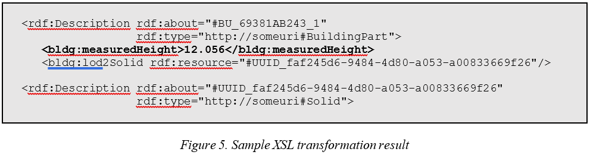

The fourth instance conversion approach was created in [13] by Marios Bekatoros utilizing [9]. The tool created has a user-friendly web Java EE webserver that extended the GML to RDF stylesheet with optional steps to convert GML into a serialization of GeoSPARQL&#39;s Well Known Text format and other RDF serializations such as N-Triples. This not only acts as a great proof of concept for GML to RDF tools, but also shows how interoperable geospatial data can be once in RDF form. Despite the fact that the tool does not directly support CityGML to RDF conversion, there are interesting elements in the optional RDF to RDF and RDF to GeoSPARQL XSLT transformations that could be useful once we can generate our own RDF data from CityGML.

In addition to the data transformation in [8], [9], Brink et al. also suggest that, even if not used in the generation of RDF data, there is important contextual value added to RDF by implementing an ontology to model the semantic relationships instantiated by the RDF. The next section will cover these approaches, some of which incorporate or include the works mentioned in this section.

### 3.2. Ontology Generation Approaches

In [9], two approaches are suggested for creating an ontology to support the resulting RDF data.

_"[The GML model] gives us two options to generate an OWL ontology: either from the UML model directly, or from the corresponding GML application schema. The first option has the advantage that UML is more mainstream information technology (IT) than GML application schemata and that a well-defined mapping from UML to OWL is defined by the OMG (Object Management Group, 2009). The second option (mapping from the GML application schema) has the advantage that it is spatially aware (since a GML application schema has well defined spatial semantics) which would result in a better mapping for spatial objects. A combination of both would be best…"_

Moving forward, it is this more "spatially aware" approach to ontology creation we will explore to not only support our generated data but also guide the data generation process. This section will summarize 4 of these XML schema to OWL approaches and the UML to OWL approach proposed in [9] as listed in table 2.

_Table 2. State of the art XML/GML model conversion approaches_

| Approach name | Author(s) | Approach Type |
| --- | --- | --- |
| _"Lifting XML schema to OWL"_ [11] | Ferdinand et al. | XML schema to OWL |
| XML2OWL [10] | Bohring and Auer | XML schema to OWL |
| Janus [14] | Bedini et al. | XML schema to OWL |
| XS2OWL [15] | Tsinaraki and Christodoulakis | XML schema to OWL |
| GML to RDF [8], [9] | Brink et al. | UML to OWL |

To generate meaningful geospatial RDF data from CityGML, the extraction of the semantic entities, attributes, and relationships from the CityGML model (CityGML UML or application schema) is required to create a CityGML ontology in OWL. After which, the axioms and properties described by the ontology can be used as a model to describe and define a CityGML linked-data set conforms to this ontology. During the extraction process there are several potential issues that need to be addressed. First whether any information lost during the conversion, and if yes, what kind of information? Furthermore, is the original model preserved in an interoperable manner? Is the ontology logically sound, including when observed by a reasoner? What happens to imported or included XML schema such as GML3 application schema or the xAL addressing library?

One of the first proposals to move XML data to OWL was made by Ferdinand et al. in [11]. In the proposal a mechanism for extracting semantic information from XML schema and "lifting" them to OWL via mapping patterns and techniques for applying reasoners to the resulting ontology. The idea behind this approach is centered around the "overlap between [XML schema and OWL], as both of them have an object-oriented foundation" despite being designed for different purposes i.e. XML Schema to represent XML document structure and OWL to represent semantic relationships. The general mappings proposed are denoted in Table 3. Furthermore, the properties created by local elements and attributes of complex and simple types are restricted in OWL by intersections of _owl:allValuesFrom_, _owl:minCardinality_, _owl:maxCardinality_, or _owl:cardinality_ whenever possible. Additionally, whenever a class or property is declared, its name should be formatted as a concatenation of its namespace URI, a &#39;#&#39;, and its local name.

_Table 3. General XML Schema to OWL mappings [11]_

| XML Schema declaration | OWL/RDFS representation |
| --- | --- |
| _xsd:complexType, xsd:group, xsd:attributeGroup_ | _owl:Class_ |
| _xsd:element_ and _xsd:attribute_ of an _xsd:complexType_ | _owl:ObjectProperty_ |
| _xsd:element_ and _xsd:attribute_ of a _xsd:simpleType_ | _owl:DatatypeProperty_ |
| Root _xsd:schema_ | _owl:Class_ with name:&#39;targetNamespace + #Schema&#39; |
| _xsd:extension, xsd:restriction, substitutionGroup_ | _rdfs:subClassOf, owl:subPropertyOf_ |
| _xsd:sequence, xsd:all, xsd:choice_ | Combinations of _owl:intersectionOf_, _owl:unionOf_, and _owl:complementOf_ |

Although these general mappings do not cover every component of XML schema – such as abstract types or datatypes – it does cover the essential parts of the language. As we will see in the following XML to RDF approaches, even though Ferdinand et al. do not propose a solution for transforming XML instances or documents to OWL or RDF these mappings will serve as the basic strategy for representing the semantic relationships of XML language components as an ontology.

A second approach – already mentioned in section 3.1 – proposed in Bohring and Auer&#39;s XML to OWL Mappings in [10] improve upon the mappings in [11] and propose a framework for converting XML instances and XML schema to OWL via XSLT transformations. In the case where XML schema is available, an OWL ontology will be created from the schema in addition to an XSLT stylesheet for transforming XML instance documents to OWL instances. As mentioned in section 3.1, an OWL ontology will be created from extracted semantic relationships in the XML instances in the case where no schema is available. It is admitted in order to create a complete ontology "a preferably representative XML instance document" is required, implying that without an XML schema there is a risk of generating an incomplete ontology. In addition to the mapping patterns proposed in [11], several refinements and additions such as _rdfs:domain_ and _rdfs:range_ declarations for properties and namespace generation suggestions are suggested.

In a third approach, supporting the propositions in [10], Bedini et al. propose an XML Schema into OWL converter named Janus in [14] based on a list of specific transformation mapping patterns. The patterns are focused on the most commonly declared elements of XML Schema. With few exceptions, there is an OWL analogue for most schema declarations and hierarchies. An XSLT stylesheet could be implemented to facilitate the transformation. Compared to the other XSD to OWL transformation proposals, this is the most comprehensive work, with 40 patterns covering 19 different XML schema constructs. However, there still remains mappings not covered, such as _xs:List_ or approaches for patterns nested within one another. In addition, this work does not cover namespace conversion like in [10], [11].

In the fourth approach, [15], Chrisa Tsinaraki and Stavros Christodoulakis propose an XSLT based transformation model to generate OWL-DL ontologies from XML schema. This model goes a step beyond other XSD to OWL approaches by generating outputs 2 files, a main.owl file which contains the main ontology, and a main2xml.owl file which contains a "mapping" ontology that can be used to convert individuals added to the ontology back into XML while respecting the original schema. The model also proposes robust, standardized naming conventions for each of its transformed elements types, attributes, and sequences.

In the article, _xs:complexTypes_ are converted into _owl:Classes_ similar to other approaches, but the _base_ attributes of _xs:extensions_ and _xs:restrictions_ are not taken into account. In other approaches such as in [10], [14], if an element has a _base_ restriction or extension attribute of a _xs:complexType_ they could be considered to have a &#39;is one of&#39; relationship to the complex type, e.g. an _rdfs:subClassOf_ relationship.

The last approach by Brink et al. [8], [9] departs from transforming XML schema to OWL ontologies, by proposing to use the ISO/TC 211 project 19150-2 guidelines and ShapeChange to implement a mapping of the GML UML model to OWL. These mappings include transformations of _gml:Feature_ types to _owl:Class_ and their respective properties to _owl:DatatypeProperties_ and _owl:ObjectProperty_ depending on whether the value of the property is a literal value or not. In addition, _rdfs:_domain and _rdfs:range_ statements can also be declared for these properties according to their relationships in UML. This largely results in a semi-automated method to transform UML in OWL.

However, Brink et al. note an exception to this approach that is shared by the previous approaches to map XML schema to OWL: "ShapeChange produces a closed-world oriented representation of the UML in OWL" i.e. the UML model (and XML schema) creates many "logical axioms that &#39;close&#39; the knowledge model, where OWL is designed to have an open-world representation. It is not yet clear, whether an open or closed transformation better serves the generation of ontologies and instances, but an open-transformation mapping should be explored.

These approaches detail potential strategies and processes that can be incorporated to create an ontology of CityGML. Not all of these can be implemented at the same time as this would create conflicts in the ontology, but many ideas can be combined from each. For example the conversion of _xs:complexType_ to _owl:Class_ is universally agreed upon in XML Schema to OWL approaches. However, there are also existing works that can supplement or even replace an ontology creation process. These are covered in the following section.

### 3.3. Existing Ontologies and Query Frameworks

In the context of GML and CityGML ontological implementations, there is an official and unofficial work which could be used to supplement and enrich the generated geospatial RDF data. Additionally, just as how the structure of an ontology can influences how to structure the RDF instances of data within the same domain, these existing works can help guide the RDF transformations as well.

Currently, one of the most mature semantic representations of the CityGML model is CityGML 2.0 OWL [16], [17] implemented to facilitate the representation of semantically linked n-D geospatial data. The general structure was based on the following rules:

- UML classes will be translated into concepts.
- Associations/roles will be translated into semantic relations.
- Association cardinalities will be expressed as restrictions relatively to relations.
- Aggregation/composition will be expressed as "part of" links.
- Generalization will be expressed as "is a" links (with the meaning of sub-concepts).
- UML attributes will be translated either into concept attributes or into relations between concepts.

Looking at the comments withing the ontology itself it appears that the final structure was extracted from the CityGML application schema, likely through a transformation language such as XSLT.

Upon initial analysis, CityGML OWL has all the classes and subclasses of the original CityGML application schema and UML. There are, however, a few distinct changes and inconsistencies from the GML. First, composite classes such as _gml:CompositeSurface_ and _gml:CompositeSolid_ do not exist. Consequently, the essential geometric primitives under _gml:Ring_ and _gml:LinearRing_ classes are not classified in this ontology. In addition, the multiplicity of relationships between classes is not expressed through object properties or axioms as suggested in [10], [14]. In order to use this ontology in geospatial RDF generation, the existing CityGML ontology some classes may need to be added to better adhere to both the CityGML XSD and UML model.

In addition to CityGML 2.0 OWL, an official geospatial ontology was created by the OGC, containing an OWL representation of GML 3.2, as a part of the GeoSPARQL project. In [4], Robert Battle and Dave Kolas describe how the GeoSPARQL framework can be implemented in order to store and query geospatial RDF data. The framework is composed of two main sections: a geospatial ontology which describes spatial and geometric entities through GML or WKT, and geospatial functions that extend SPARQL queries.

Since the GeoSPARQL ontology has a representation of GML 3.2 parts of it can be reused to represent and define our generated RDF data. CityGML 2.0 uses GML 3.1 to represent its geometries – which has a similar, but not exact structure to GML 3.2. An additional feature of GeoSPARQL is its literal datatype of _geo:gmlLiteral_ which directly allows GML to be serialized in OWL just similar to how _rdfs:XMLLiteral_ allows xml literal data to be represented in RDF. This literal representation is valid for GML 3.1 types that are in the substitution group of the _\_Geometry_ type. Once the GML is stored as a datatype, it can be related to non-geometric classes through the _geo:hasGeometry_ and _geo:asGML_ properties.

Implementing _geo:gmlLiteral_ also allows for the use of GeoSPARQL&#39;s geospatial functions. These functions can be used to filter query results based on spatial relationships such as the distance between two points or whether a geometry intersects with the boundary of a polygon. Battle et al. demonstrate that by using Parliament, an RDF triple-store that features a GeoSPARQL query endpoint, these functions can be quickly implemented and can efficiently process geospatial queries.

Both CityGML 2.0 OWL and the GeoSPARQL project give us tools to enhance our transformation of urban CityGML geospatial data. As GeoSPARQL is an official OGC proposed framework and provides an invaluable geospatial extension to SPARQL, the implementation proposed in this report will integrate it in order to give the resulting data a dimension of interoperability and to facilitate more powerful queries. Although CityGML 2.0 OWL is one of the most mature ontological models of CityGML, this report will not be directly integrating it in favor of other transformations to OWL. Instead, a new ontological model will be created through XSLT transformations. However, the strategies used to create this ontology can still be used to guide the transformations of this new model.

### 3.4. Synthesis of Works

To create a semantic geospatial representation of CityGML there are several aspects of the previous approaches that can be integrated into this proposal. As a result of the large body of research in mapping transformations between XML formats to RDF and OWL as shown in table 4, XSLT will be used as the vehicle for converting CityGML into RDF in this proposal. As stated in [15] transformations that assume the CityGML model structure without the XML schema may be incomplete. Since maintaining interoperability is a fundamental goal of this project, an approach that takes into consideration the CityGML model must be used. For this, we will use the CityGML application schema to create transformation mappings for CityGML instances to RDF [10], [12]. Furthermore, we can create an ontology to support our RDF data using the well documented mappings of [10]–[12], [14], [15].

_Table 4. Comparison of transformation approaches_

| Proposed Approach/Tool | Transformation/ programming Language(s) | Ontology Generation | Data Generation |
| --- | --- | --- | --- |
| _UML to OWL_ | _XSD to OWL_ | _XML to RDF_ | _GML to RDF_ |
| GML to RDF [9] | XSLT | x | | | x |
| GML to stRDF [13] | XSLT | | | | x |
| XS2OWL [15] | XSLT | | x | | |
| XML2OWL [10] | XSLT | | x | x | |
| Lifting XML schema to OWL [11] | Java | | x | | |
| Janus [14] | XSLT+SAX | | x | | |
| Software Tools for XML to OWL translation [12] | C++ | | x | x | |

In general, there are several mappings consistently agreed upon by many previous approaches [10]–[12], [14], [15] in XSD to OWL transformation. For example, _xs:complexTypes_ are always mapped to _owl:Classes_ and their _xs:element_ children are respectively mapped to _owl:DatatypeProperties_ and _owl:ObjectProperties_ depending on their type of content. Bedini et al. explore less commonly seen XML schema elements such as _xs:group_, _xs:complexContent_, and many others [14]. In table 5 we can see a general compilation of how these schema elements and attributes are typically represented in OWL.

_Table 5. Common XML Schema to OWL mapping concepts [10]–[12], [14]_

| XML Schema Element or Attribute | OWL Target |
| --- | --- |
| xs:complexType | owl:Class |
| xs:simpleType | rdfs:datatype |
| Global xs:element with a type of an xs:complexType | owl:Class with an rdfs:subClassOf relationship to the type |
| Global xs:element with a type of an xs:simpleType | rdfs:datatype with an owl:equivalentClass relationship to the type |
| child xs:element of a xs:complexType with a xs:complexType type | owl:ObjectProperty with an rdfs:domain of the parent type and rdfs:range of its own type |
| child xs:element of a xs:complexType with a xs:simpleType or native xs datatype type | owl:DatatypeProperty with an rdfs:domain of the parent type and rdfs:range of its own type |
| xs:attribute | owl:DatatypeProperty with an rdfs:domain of the parent type and rdfs:range of its own type |
| xs:sequence or xs:all | owl:restriction composed of owl:intersectionOf |
| xs:choice | owl:restriction composed of owl:intersectionOf, owl:unionOf, and owl:complementOf |
| xs:group | owl:Class |
| xs:attributeGroup | owl:Class |
| substitutionGroup attribute | rdfs:subClassOf |
| base attribute | rdfs:subClassOf, owl:DatatypeProperty, or owl:ObjectProperty depending on the type of content |
| minOccurs attribute | owl:minCardinality |
| maxOccurs attribute | owl:maxCardinality |

The GML to RDF approaches proposed in [8], [9], [13] will not be used to create the mappings in this work as the RDF produced assumes the a structure that is not based on the CityGML or GML application schema and the resulting ontology. However, there are several GML mapping concepts that can be incorporated such as using the _gml:id_ attribute as the _rdf:id_ of our RDF instances and converting _gml:geometry_ elements into GeoSPARQL&#39;s _gml:gmlLiteral_ values where applicable to give the generated data the important element of interoperability.

Note that table 5 represents a consensus of how these concepts are represented in OWL but does not list every possible representation. For example, Bedini et al. proposed a nuanced approach towards the transformation of _xs:choice_. Instead of using _xs:intersectionOf_, _xs:unionOf_, and _xs:complementOf_ one could create a disjoint subclass for each of the declared choices that contains only the elements of that choice [14]. In the case where there are several interpretations of an OWL representation of XML schema each was considered and explored during development and the most preferable approach for transforming CityGML and GML was used. The reasoning and implementation of these approaches will be covered in the next section.

## 4. From CityGML Urban Data to Linked Data: A Proposed Approach

To create a proof of concept tool for the generation of geospatial data from CityGML, an XSLT-based pipeline was created, specifically based on [10], [12] and proceeds as follows (fig. 6):

1. The generation of an intermediate XSLT to transform CityGML instances to RDF from the GML and CityGML application schema.
2. Generation of CityGML RDF instances using the previously generated XSLT and CityGML data from the metropole of Lyon.
3. The creation of an OWL ontology to describe the resulting CityGML instances from the GML and CityGML application schema.

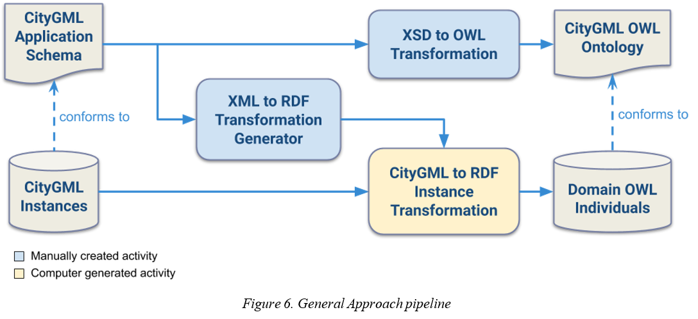

During each transformation, conflicts must be auto resolved, and the resulting information must be logically consistent and maintain its interoperability from CityGML. To ensure this several challenges need to be overcome. For instance, the RDF structure and types generated from the GML instances must conform to the model described by the ontology. How can mappings be created to ensure this? CityGML application schema often implements elements that do not have a direct equivalent in OWL or RDF. How should these elements be represented to best describe CityGML as semantic data? In addition, CityGML schema often draws from elements, types, functionality from external schema such as GML, xLinks and xAL addresses. How should these imports be addressed to preserve their original functionality? The various approaches discussed in the previous sections provide different responses to these questions and thus the most appropriate choice must be utilized in the context of rendering CityGML as linked geospatial data.

### 4.1. Approach Structure and Design

The workflow of the processes in this report are broken up into two pipelines: an instance transformation pipeline and a model transformation pipeline. Both pipelines are treated as activities in a 3rd "complete" pipeline which illustrates the conversion process in its entirety and how the various application schema of GML, CityGML, and other imported schema are combined.

Fig. 7 shows the activity diagram for the instance transformation pipeline. In this workflow, the CityGML schema is passed into an XSLT processor to extract the semantic metadata within and create a second XML to RDF XSLT stylesheet. This second stylesheet can be used to transform XML instance files – that conform to the CityGML application schema – into RDF. The stylesheet naturally implements the OWL vocabulary to produce OWL individuals and contains specialized transformations for GML elements to integrate GeoSPARQL vocabulary. The resulting RDF output file of the second transformation will contain import statements for the CityGML ontology as suggested in [10]. After the instance file is produced, a final "postprocessing" activity is performed to validate the generated RDF. This activity utilizes a Python script with the _lxml_ library to parse the RDF graph and primarily removes any duplicate instances or properties. Note that the output documents shown in Fig. 12, 13, and 14 are serialized in RDF and use the &#39;.rdf&#39; file suffix, but all outputs still implement the OWL vocabulary whenever necessary.

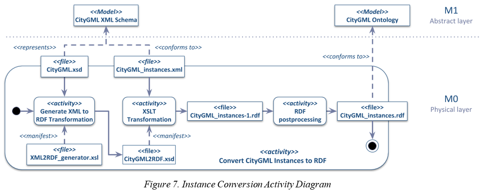

The process for converting the CityGML application schema into an OWL ontology is shown in Fig. 8. This process starts with a transformation activity where the XML Schema model to OWL mapping patterns and strategies proposed in [10]–[12], [14] will be implemented. In general, the mapping patterns of table 4 are implemented. Exceptions to this are described in detail in section 4.3. After the transformation activity, a postprocessing script is run on the ontology, like the one utilized in the instance conversion activity. This script imports and integrates the GeoSPARQL ontology, and fully qualifies any namespaces prefixes used in RDF attributes such as _rdf:resource_. This renders an OWL ontology constrained by the CityGML application schema, thus providing a model for the OWL individuals created in the instance transformation process.

Due to the large number of schemas used to model GML and the modules of CityGML, these processes would have to be run several times per schema document to create a complete CityGML ontology. In addition, the elements in CityGML and GML often refer to and rely on information stored in each other and in external schema documents and thus the XSLT processor must have access to all referenced metadata at the same time. In the XML schema vocabulary, this external information is referenced through _xs:import_ and _xs:include_ statements that link to the external document. In order to solve this issue for CityGML and GML a "composite" schema made up of all the elements and type declarations of every required schema will be created. After a composite schema is created, it will be passed to both transformation activities as shown in Fig. 9 illustrates process in its entirety. The schema compilation activity must also normalize or fully qualify the namespace prefixes from each schema document to match. This is required to maintain consistent naming conventions and to simplify namespace resolution during transformations as prefixes may change between schema documents and RDF requires fully qualified namespaces anytime a URI is given. This activity will also remove leading and trailing whitespace between XML elements and from element text to provide the "cleanest" and most compact schema possible. Like the previous activities not powered by an XSLT processor, this XML schema compilation activity is manifested by a Python script using the _lxml_ library.

### 4.2. Transforming CityGML Instances into RDF

When generating the CityGML instance to RDF transformation, it is important that the patterns created are general enough to be reused and can take advantage of the CityGML vocabulary whenever possible. This process will use the general structure of the XML to RDF mappings proposed in [10], [12] in addition to some GML to RDF mapping concepts proposed in [1], [8], [9]. There will also be consideration taken so that these mappings work with the ontology to be generated in alongside the RDF data.

In general, three types of mappings will be created from the schema:

1. All global _xs:element_ elements that have the type of an _xs:complexType_ create a template for generating _owl:NamedIndividuals._
2. All _xs:complexType_, _xs:simpleType_, _xs:attributeGroup_, and _xs:group_ elements create a template that compiles the templates for every possible child element, text, and attribute of the element.
3. All _xs:_attributes or xs_:elements_ which are children of _xs:complexTypes_ or _xs:groups_ create templates for _owl:ObjectProperties_ and _owl:DatatypeProperties_.

 To illustrate how these mapping types work, we will use an example from the CityGML core module. Fig. 10 shows the schema for the _core:\_CityObject_ element and its type, _core:AbstractCityObjectType_. The initial transformation of these schema elements, as proposed in this report, would yield a transformation pattern as shown in Fig. 11.

To generate this result, three transformations patterns are implemented. First, if a global _xs:element_ is found – such as _core:\_CityObject –_ and it has a type of an _xs:complexType_ or has a child _xs:complexType_, a template will be generated to create an individual. The template generated will use the _gml:id_ attribute of the element it matches as the _rdf:ID_ of the instance as proposed in [9]. If no _gml:id_ is available, a unique id will be generated and appended to the local name of the element. Also as suggested in [9] the _rdf:type_ of each individual should be generated from its local name and this is well implemented here. However, in this proposal the tertiary conversion to GeoSPARQL will be made based on this _rdf:type_ and thus the full name will be used to distinguish between a gml geometry element and a feature. After the individual is named and typed, the template will call a reusable template generated from the _xs:complexType_ type of the element. This template will contain the CityGML to RDF templates to generate the _owl:ObjectProperties_ and _owl:DatatypeProperties_ for the individual.

The second type of mapping concerns the transformation of the _xs:complexType_ element. It contains 4 sub-transformations that determine the elements and attributes the type could have and create a template that calls additional templates to create the appropriate _owl:ObjectProperty_ and _owl:DatatypeProperties_. The sub-transformations are as follows:

1. Collect all descendant _xs:elements_ and call the matching templates to generate _owl:ObjectProperty_ or _owl:DatatypeProperty_ templates depending on the content of the element.
   * If an element belongs to a _substitutionGroup_ the corresponding templates for all elements in that group must also be generated.
2. Collect all descendant _xs:attributes_ and call the matching templates to generate _owl:DatatypeProperty_ templates.
3. If there is an _xs:extension_ or _xs:restriction_ of any other type, the template for that type must be generated as well according to the _base_ attribute.
4. Collect all _xs:group_ and _xs:attributeGroup_ references and call the matching templates for these groups.

Normally the template for _core:\_CityObject_ will never be called as it is an abstract _xs:element_, however in the case of the _bldg:Building_ element – which is often used in CityGML instances – both elements are in the same _substitutionGroup_ and can be used interchangeably._bldg:Building_ also has the complex type _bldg:AbstractBuildingType_ which inherits the same complex type template as _core:AbstractCityObjectType_. Because of these relationships, whenever a _bldg:Building_ element is declared, its transformation pattern will call the template for _core:AbstractCityObjectType_.

Another XML transformation proposed is the conversion of _xs:complexTypes_ with _xs:simpleContent._ Transformation mapping patterns of _xs:simpleContent_ and _xs:complexContent_ to OWL are proposed in [14] but without a transformations for XML instances of these types. _xs:simpleContent_ proved to be one of the more complicated instance transformations to RDF as _xs:complexTypes_ are always transformed into _owl:classes_ yet _xs:simpleContent_ constrains the type to only contain attributes and/or text with no child elements. This implies that these types can sometimes appear as _rdfs:Datatype_ elements. For example, Fig. 12 shows the schema for one such type, _gml:MeasureType_. In XML this type could be instantiated as an element with a text value of a double and an attribute of a URI.

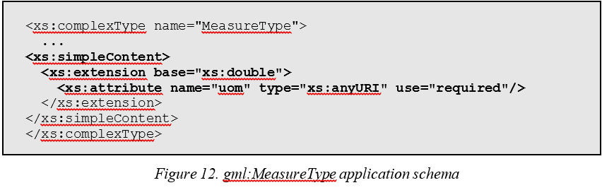

This report bases the proposed instance transformation of these types off of the approach used in [14] with several transformation mappings listed in table 6. In the case that the complex type with a simple content has an _xs:restriction_ of a type, a new _rdfs:datatype_ and _owl:DatatypeProperty_ would be declared in the ontology according to these restrictions and should be used when transforming the instance data into RDF. Note, that when referencing the newly created datatype of an _xs:restriction_, &#39;Datatype&#39; is appended to the name of the type and the property to avoid overlapping identifiers . Otherwise when the simple content is based on an _xs:extension_ of datatype or simple type, there is only an _owl:DatatypeProperty_ created that links to the datatype value.

_Table 6. XML Schema to RDF intstance mapping patterns_

| XML Schema pattern | Target instance pattern |
| --- | --- |
| \&lt;xs:complexType name="TypeName"\&gt; \&lt;xs:simpleContent\&gt; \&lt;xs:extension base="nativeDatatypeName"\&gt; ...\&lt;/xs:extension\&gt;\&lt;/xs:simpleContent\&gt;\&lt;/xs:complexType\&gt; |\&lt;owl:NamedIndividual\&gt; \&lt;rdf:type rdf:resource="TypeName"/\&gt; \&lt;hasNativeDatatypeName\&gt; someValue \&lt;/hasNativeDatatypeName\&gt; ...\&lt;/owl:NamedIndividual\&gt; |
| \&lt;xs:complexType name="TypeName"\&gt; \&lt;xs:simpleContent\&gt; \&lt;xs:extension base="simpleTypeName"\&gt; ...\&lt;/xs:extension\&gt;\&lt;/xs:simpleContent\&gt;\&lt;/xs:complexType\&gt; |\&lt;owl:NamedIndividual\&gt; \&lt;rdf:type rdf:resource="TypeName"/\&gt; \&lt;hasSimpleTypeName\&gt; someValue \&lt;/hasSimpleTypeName\&gt; ...\&lt;/owl:NamedIndividual\&gt; |
| \&lt;xs:complexType name="TypeName"\&gt; \&lt;xs:simpleContent\&gt; \&lt;xs:restriction base="nativeOrSimpleDatatype"\&gt; ...\&lt;/xs:restriction\&gt;\&lt;/xs:simpleContent\&gt;\&lt;/xs:complexType\&gt; |\&lt;owl:NamedIndividual\&gt; \&lt;rdf:type rdf:resource="TypeName"/\&gt; \&lt;hasTypeNameDatatype\&gt; someValue \&lt;/hasTypeNameDatatype\&gt; ...\&lt;/owl:NamedIndividual\&gt; |

One departure from the previous XML schema to OWL approaches is how _xs:group_ and _xs:attributeGroup_ are transformed. In [11], [14] both of these elements are converted into _owl:Classes_ as they contain elements and attributes like _xs:complexTypes_. However, in the context of CityGML and XML to RDF data generation these groups serve mostly utility and do not appear in XML instances as individual elements. For instance, Fig. 13 shows a GML group and a complex type which references this group and Fig. 14 shows a CityGML instance that implements them both.

In the instance, the _bldg:Building_ element of the complex type is clearly instantiating child elements from the _xs:group_ however there is no actual reference to the group itself. That is to say, the child elements of _gml:StandardObjectProperties_ are instantiated but the group itself is not formally instantiated. Functionally, _xs:groups_ and _xs:attributeGroups_ serve as a reusable collection elements and attributes. This report argues that because of this behavior, they do not represent _owl:Classes_ but are simply features of the XML schema vocabulary. Instead, in XML to RDF transformation, these groups can be transformed into templates that simply contain references to the templates of their properties (fig. 15).

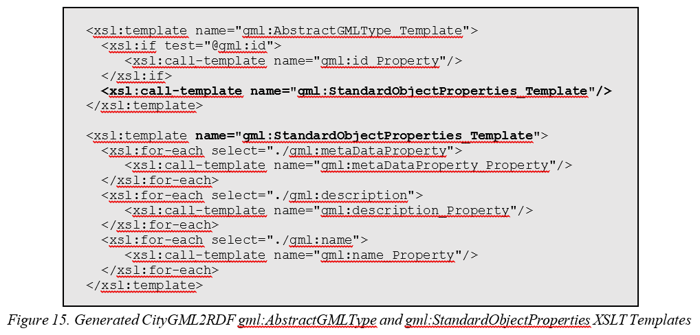

Transformations will also map the original GML literal values to an RDF triple using GeoSPARQL&#39;s _geo:asGML_ datatype property, if an instance&#39;s type is in the substitution group of _gml:\_Geometry_. This process is covered in detail in section 4.4.Once an instance document is transformed, it must be scanned for malformed RDF triples and fully qualifies any RDF attributes that contain prefixed URI strings such as _rdf:resources_, _rdf:type_, and _rdf:about_. These transformations follow the "garbage in, garbage out" concept that poorly formed data input into a program, will produce nonsensical results, and thus assume that the GML and CityGML instance documents provided are well structured and conform to their application schema. If this assumption is met, the resulting data should conform to the ontology transformation discussed in the following section.

### 4.3. Generating a CityGML Ontology from XML Schema

During development, several choices were made to create a transformation of the CityGML application schema that respects its original structure while maintaining logical consistency, even when considering the inferences of an OWL reasoner. In particular: what should be done with schema elements which have no direct representation in OWL? How to standardize and automate namespace and id generation? And finally, how should all these things be considered under the context of generating RDF data from CityGML alongside this ontology?

The first of these choices that was made was regarding the transformation of schema elements with no direct representation in OWL. In the case of _xs:choice_ a combination of _owl:intersectionOf_, _owl:unionOf_, and _owl:complementOf_ are suggested in several approaches [10], [11], [14], [15]. In description logic, unions, intersections, and complements are analogous to logical _&#39;and&#39;_, _&#39;or&#39;_, and _&#39;not&#39;_ relationships, respectively. More precisely, the use of _xs:choice_ is analogous to the description of a class that contains the group of _&#39;exclusive or&#39;_ (XOR) properties as shown in equation (1).

_(A ∪ B) ∩ (A ∩ B)C_ (1)

XOR can be described with the previously mentioned owl groups. For example, the _xs:complexType_ from CityGML in Fig. 16 can be represented in owl as the following RDF in Fig. 17.

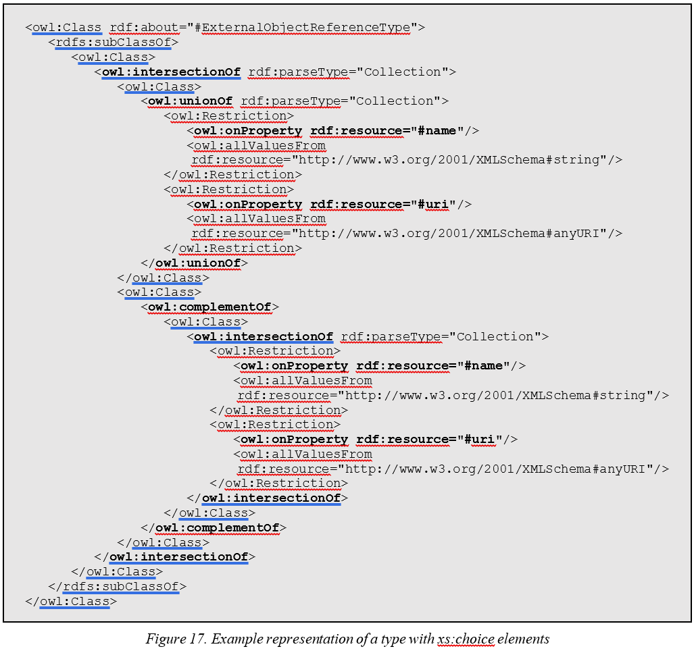

 This approach, however, creates a very long and complex class description, which explodes when more than two _xs:choice_ children are transformed, especially in RDF. This is because the intersections of each statement must be pairwise disjoint as in (2).

_(A ∪ B ∪ C) ∩ ((A ∪ B) ∩ (A ∪ B) ∩ (A ∪ B))C_ (2)

The resulting transformation in OWL of this increases in size exponentially with every child node of an _xs:choice_ with this approach.

Another approach suggested in [14] is to create separate subclasses of the _xs:complexType_. These subclasses are disjoint and enumerate each possible _owl:restriction_ (fig. 18) created from the elements declared in the _xs:choice._ This approach is preferable to the first as it does not generate an exponential amount of _owl:restrictions_ to represent each _xs:choice_ element.

While both of these approaches are logically valid for representing CityGML schema in OWL, an approach using OWL-2&#39;s _owl:disjointUnionOf_ was experimented with (fig. 19), which provides an even more concise transformation. The example in Fig. 16 could be converted into the RDF in Fig. 19. This result represents the disjoint union of the class that has either has the property _#name_ or _#uri_ but not both.

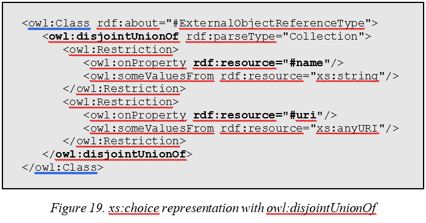

 This implementation was tested in Protégé with the HermiT reasoner. An individual &#39;someReference&#39; was instantiated with both _#name_ and _#uri_ datatype properties. The reasoner returned the following explanation in Fig. 20 and declared the ontology inconsistent, as intended.

In addition to _xs:choice_ there is not a universally agreed upon OWL mapping for the _xs:list_ restriction of a datatype. Since most datatypes in GML can be represented in GeoSPARQL through a _geo:gmlLiteral_, this issue was ignored. For this XML schema to OWL transformation datatype lists are declared, but no restrictions or equivalent class axioms are generated. This is illustrated in Fig. 26 and 27.

Moreover, there a native XML Schema element that is problematic when creating OWL properties, _xs:anyType_. In the CityGML application schema this type is used to allow extensible CityGML types and functionality, such as the _bldg:\_GenericApplicationPropertyOfAbstractBuilding_ abstract element of type _xs:anyType_. Consequently, to allow these elements to exist, a _xs:anyType_ class is declared and any elements of this type are declared as a subclass of it. If an extension to CityGML schema was created, their classes could be mapped as the _owl:equivalentClasses_ of these proposed classes in order to integrate into the ontology. The usage of these classes is of course optional, as denoted in the application schema through the _minOccurs="0"_ attribute. When mapping axiom restrictions, all mappings use _owl:someValuesFrom_ which implies that the instance of the class contains at least one property of this type. These are paired with the mappings in [10], [14], to generate _owl:minCardinality_ and _owl:maxCardinality_ whenever the _minOccurs_ or _maxOccurs_ attribute is used to define a child element, allowing these instances to have an _owl:minCardinality_ of 0 and thus keeping the class description conformed to the application schema.

One final consideration of the transformation process is the naming conventions of classes and properties. The transformation itself generates an intermediate identifier of the name of the entity appended to its namespace prefix. For example, the schema element in Fig. 21 would result with the attribute _rdf:about="gml:ExternalObjectReferenceType"_. Like in the XML to RDF pipeline a script is run after the transformation to fully qualify names into complete URIs. Similar to the naming conventions proposed in [9], the URIs used to name these entities are created from a the following pattern:

_[domain]/[namespace prefix]#[object identifier]_ (3)

The names of transformed elements are appended to a predetermined domain, followed by the filename of the schema they were declared in – including each possible CityGML module – and then the name of the object itself. In the case of _rdf:about="gml:ExternalObjectReferenceType"_, the final output would be:

_rdf:about=http://domain.uri/gml#ExternalObjectReferenceType_ (4)

An exception to this pattern occurs when the descendant _xs:elements_ of _xs:complexTypes_ are transformed into _owl:ObjectProperties_ but reference an existing element instead of naming a new one. In order to differentiate the property from the referenced class, whenever an object property is created from the schema _&#39;ref&#39;_ attribute, &#39;has&#39; is added to the referenced name. In the case of the references to _gml:name_ and _gml:description_ made above, in Fig. 18, the final class identifiers would be:

_rdf:about=http://domain.uri/gml#hasname_ (5)

_rdf:about=http://domain.uri/gml#hasdescription_ (6)

These proposed strategies for XML schema to OWL transformation are an amalgam of previous transformation approaches with several specializations for the CityGML application schema. However, they are largely generalized and can be applied to schema outside of the main GML and CityGML schema, such as the external xAL addressing schema occasionally used by CityGML. The final step in converting CityGML into linked urban data, is the addition of the GeoSPARQL vocabulary and functionality into the ontology and converted instances.

### 4.4. Integrating GeoSPARQL

The addition of the official GeoSPARQL&#39;s vocabulary and ontology into these transformations is critical for providing interoperability as linked data. Since this approach features two distinct transformations for CityGML, the integration takes place in two parts of the pipeline: inside the XML instance to RDF transformation based on the implementations of [9], [13] and in the postprocessing script after the XML schema to OWL transformation based on the suggestions in [4]. In these transformations several things must be taken into consideration such as the differences between the GML 3.2 ontology and the GML 3.1 application schema the transformations are based off and creating RDF instances that can be queried with GeoSPARQL functions.

Linking the generated CityGML ontology with GeoSPARQL is as straightforward as declaring two axioms. The class generated by _gml:\_Geometry_ is declared a subclass of _geo:Geometry_ and the class generated by _gml:\_Feature_ is declared a subclass of _geo:Feature_. This allows all subclasses of _gml:\_Feature_ and _gml:\_Geometry_ touse GeoSPARQL properties. Features such as _blgd:Building_ may implement the object property _geo:hasGeometry_ to link to their respective geometries and geometries like _gml:Solid_ can link to their GML representations with the datatype properties _geo:asGML_. Since GeoSPARQL endpoints can parse _geo:gmlLiterals_ to perform spatial queries, the text stored in the original instance document can be reused to retain their geospatial information in OWL.

The official GeoSPARQL documentation states that:

_Valid geo:gmlLiterals are formed by encoding geometry information as a valid element from the GML schema that implements a subtype of GM\_Object … In GML 3.1.1 and GML 2.1.2 this is every element directly or indirectly in the substitution group of the element {http://www.opengis.net/ont/gml}\_Geometry. [18]_

According to the resulting CityGML ontology this implies the following classes are either "directly or indirectly" in the substitution group of _gml:\_Geometry_ as shown in Fig. 23. During CityGML instance to RDF transformation, any element that is one of these classes and contains only ancestors of these classes, will retain a copy of their GML instance as a _geo:gmlLiterals_ after transformation (fig. 24, 25).

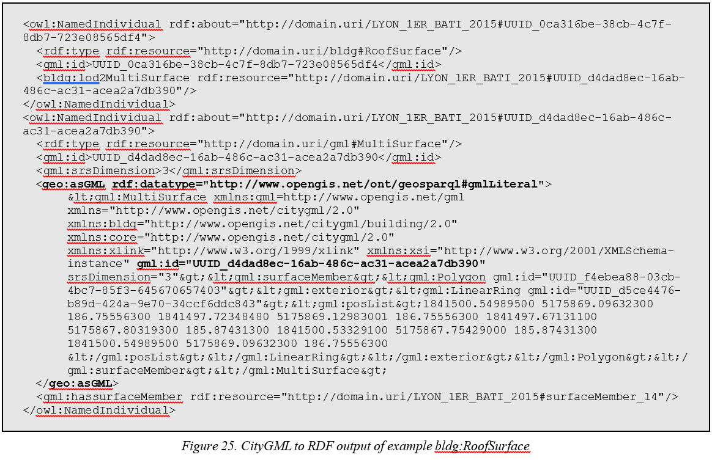

If a particular coordinate system is used, it must be declared in the literal value as a _gml:srsName_ attribute in order for GeoSPARQL endpoints to accurately parse the data. The default reference system is _\&lt;http://www.opengis.net/def/crs/OGC/1.3/CRS84\&gt;_, thus any GML data that uses a different reference system must include it in the GML instances themselves or manually add it to the output _gml:gmlLiterals_ after transformation.

Through these processes a consistent strategy for generating geospatial linked data from CityGML instances can be implemented. In the next section this report will review the output of this approach when applied to real CityGML instances from the metropole of Lyon, France and the results using a GeoSPARQL endpoint to query the generated data.

## 5. Results

Using the CityGML core and building modules&#39; application schema alongside the GML application schema, a CityGML ontology and instance transformation XSLT was created. This proof of concept ontology was named "CityOWL" and describes the transform yielded by the XSLT stylesheet which was named "CityGML2RDF". The stylesheet was tested with the transformation of CityGML instance data from the grand metropole of Lyon. This section will discuss the results of both transformations and the results and behavior of the GeoSPARQL queries implemented on them.

### 5.1. "CityOWL" Ontology

The CityOWL ontology is formed from a composite schema, made up of the 31 documents found in the GML 3.1.1 application schema, the CityGML core application schema, and the CityGML building application schema. The general contents of the ontology are shown in table 7. Creation of the composite schema was done using Python and the _lxml_ library. The transformations themselves were powered by the _Saxon HE_ XSLT processor. The creation of CityOWL, including post-processing, elapsed _3.635_ seconds using these tools. The structure of the _gml:\_Feature_ and _gml:\_Geometry_ classes are shown in Fig. 26 and 27.

_Table 7. CityOWL metrics_

| Statistic | Measure |
| --- | --- |
| Classes | 968 |
| Object Properties | 484 |
| Datatype Properties | 160 |
| Declared Axioms | 5624 |
| Total Size | 1.1 MB |

### 5.2. Generated Dataset

The dataset showcased here was generated from the _Maquette 3D texturée de Lyon 1er Arrondissement_ datasets from [_https://data.grandlyon.com/accueil_](https://data.grandlyon.com/accueil), an open geospatial data repository for the metropolis of Lyon. These datasets describe the buildings of the 1er arrondissement of Lyon with LOD2 GML geometry from the years 2009, 2012, and 2015. The textures and CityGML _appearance_ and _generic_ module have been lifted from the dataset, just leaving the GML and CityGML _core_ and _building_ modules. Table 7 shows statistics from the conversion and resulting dataset.

One notable difference between the 2015 dataset and rest, is the usage of CityGML 2.0. Despite the 2009 and 2012 datasets using an older version of CityGML, both versions still rely on GML 3.1.1 application schema and the transformation process is general enough to work for either version. Additionally, the data itself becomes more accurate in 2015 as the number of described building objects increases due to each building inside of a complex of buildings count as distinct building objects. Consequently, this greatly increases the execution time of the pipeline as shown in table 8.

_Table 8. Data conversion statistics_

| Filename | Input Size (MB) | City Objects | Input Nodes | Output Size (MB) | Output RDF Triples | Execution Time |
| --- | --- | --- | --- | --- | --- | --- |
| LYON\_1ER\_BATI\_2009 | 68.1 | 153 | 571801 | 281.9 | 913049 | 5:07 |
| LYON\_1ER\_BATI\_2012 | 68.4 | 153 | 574227 | 283.1 | 917002 | 4:53 |
| LYON\_1ER\_BATI\_2015 | 65.6 | 1711 | 524990 | 279.9 | 843223 | 20:48 |

Fig. 28 shows an example of a generated building instance and its instance geometry when imported into Protégé at the same time as the CityOWL ontology. Each individual is automatically linked to its type through the naming conventions used in both transformations.

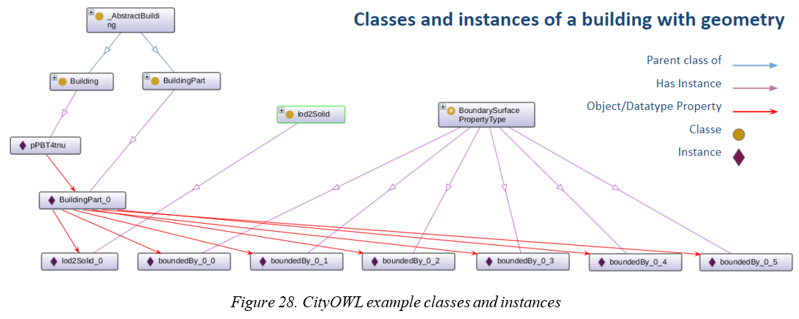

### 5.3. Query Results

Once the dataset was generated, a GeoSPARQL endpoint was installed to perform geospatial queries. The Parliament triple-store [19] was used for this purpose as proposed in [4] since it contains a SPARQL endpoint with GeoSPARQL support based on the Apache-Jena libraries. The following queries shown in Fig. 30, 31 and 32 demonstrate basic geospatial queries applied to the converted RDF individuals. Tables 9, 10, and 11 show their resulting output.

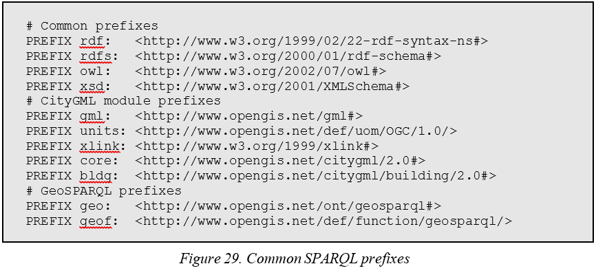

_Table 9. Query #1 results_

| building | predicate | object |
| --- | --- | --- |
| #BU\_69381AI48 | bldg:consistsOfBuildingPart | #BU\_69381AI48\_1 |
| #BU\_69381AI48 | core:creationDate | "2017-04-05"^^xs:date |
| #BU\_69381AI48 | gml:hasboundedBy | #boundedBy\_1012 |
| #BU\_69381AI48 | gml:hasname | #name\_1012 |
| #BU\_69381AI48 | gml:id | "BU\_69381AI48"^^xs:id |
| #BU\_69381AI48 | rdf:type | bldg:Building |
| #BU\_69381AI48 | rdf:type | owl:NamedIndividual |

_Table 10. Query #2 results_

| feature | serialization |
| --- | --- |
| #UUID\_17cb5011-6e9a-438f-b521-614bb261435b | "\&lt;gml:MultiSurface xmlns:gml=\"http://www.opengis.net/gml\" xmlns=\"http://www.opengis.net/citygml/2.0\" xmlns:bldg=\"http://www.opengis.net/citygml/building/2.0\" xmlns:core=\"http://www.opengis.net/citygml/base/2.0\" gml:id=\"UUID\_17cb5011-6e9a-438f-b521-614bb261435b\" srsDimension=\"3\"\&gt;\&lt;gml:surfaceMember\&gt;\&lt;gml:Polygon gml:id=\"UUID\_e7a262b8-319d-455d-8333-65cdcc932eee\"\&gt;\&lt;gml:exterior\&gt;\&lt;gml:LinearRing gml:id=\"UUID\_da55c6aa-0365-49e1-81ff-b319ef7e1223\"\&gt;\&lt;gml:posList\&gt;1842539.17326200 5175534.09319300 192.16285300 1842533.95778000 5175532.96066900 191.95614900 1842533.95778000 5175532.96066900 167.60000000 1842539.17326200 5175534.09319300 167.60000000 1842539.17326200 5175534.09319300 192.16285300 \&lt;/gml:posList\&gt;\&lt;/gml:LinearRing\&gt;\&lt;/gml:exterior\&gt;\&lt;/gml:Polygon\&gt;\&lt;/gml:surfaceMember\&gt;\&lt;/gml:MultiSurface\&gt;"^^geo:gmlLiteral |

_Table 11. Query #3 results_

| geometry | type |
| --- | --- |
| #UUID\_58ba18c5-2840-4672-8250-2e868bae9d39 | http://www.opengis.net/ont/gml#MultiSurface |
| #UUID\_8e4ec2bb-6dee-4d59-9a34-d7bd420bc9e3 | http://www.opengis.net/ont/gml#MultiSurface |
| #UUID\_108ae372-bb7c-4380-9f4c-a8c647e95daa | http://www.opengis.net/ont/gml#MultiSurface |
| #UUID\_10125ec6-769a-430c-ada6-70bceec68ddd | http://www.opengis.net/ont/gml#MultiSurface |
| #UUID\_febd25f5-7c09-4949-bd76-3b078634d44d | http://www.opengis.net/ont/gml#MultiSurface |
| #UUID\_2e446949-7cd6-41a8-a849-3ab9c66d30c0 | http://www.opengis.net/ont/gml#MultiSurface |
| #UUID\_4259a93c-d301-4146-95aa-6c7e2d4dabd6 | http://www.opengis.net/ont/gml#MultiSurface |
| #UUID\_d4dad8ec-16ab-486c-ac31-acea2a7db390 | http://www.opengis.net/ont/gml#MultiSurface |

The resulting dataset produced by these transformations was used by another team from LIRIS. The _Graphs, AlgOrithms, and AppLications_ (GOAL) team was able to take these resulting RDF instances into a parallel research project to study the methodology and effectiveness of graph compression and resulting query performance. The ultimate goal of this collaboration between the three LIRIS teams is to render an efficient compression algorithm that respects the needs of geospatial queries.

## 6. Conclusion and Future Work

### 6.1 Synthesis of Contribution

N-D geospatial data comes in many forms and can be difficult to analyze alongside other forms of urban data. There is a need for researchers and city planners to be able to study different forms of this data to understand the inherent relationships between them and how they evolve over time. The semantic web and linked data directly respond to this problem by making data inherently interoperable through a single standard form and using the relationships between points of data as a core feature of the representation. This report highlights 4 major contributions to this effort: firstly, a study, analysis, and comparison of several tools and approaches available for the conversion of urban data into linked data formats; secondly, the implementation of a proof of concept tool to read and convert CityGML instances into multidimensional geospatial RDF data; thirdly, the implementation of a proof of concept tool to generate an ontology constrained through cardinality, domain, range, and strongly typed class axioms as a semantic model of CityGML; finally, the implementation of initial geospatial queries to analyze the generated linked data that consider the structure of CityGML features. In addition, these contributions demonstrate the feasibility of integrating existing linked data standards such as GeoSPARQL.

However, there are several limitations of this proof of concept approach ranging from concepts not employed to areas that are lacking in performance. The first of which are the elements of XML schema not recognized by the transformation mapping patterns. Certain datatype elements such as _xs:list_ and _xs:element_ attributes such as _optional_ and _abstract_, among others, are not taken into consideration during these transformations. Developing consistent transformation mappings for these could provide more accurate and rich geospatial linked data models and transformations. The model transformations also occasionally produce conflicting axioms depending on duplicate names are used to define properties, which occasionally occurs in the GML application schema. For instance, the _owl:DatatypeProperty__gml:factor_ is declared once as having an _rdfs:range_ of _xs:integer_ and again with a range of _xs:double_. When a reasoner is run, any classes that use this property in an _owl:someValuesFrom_ axiom are inferred to be equivalent to _owl:Nothing_, as these ranges conflict. A modification could be made to the model post-processing script that consolidates these axioms with an _owl:UnionOf_ statement.

Additionally, the instance post processing activity itself is time-consuming especially when converting a breadth heavy XML tree. This means performing "live" data conversion is not feasible and would require further optimizations to either the transformations or the scripts themselves. Furthermore, the representation in RDF takes up a considerable amount of storage space compared to the original GML format. It may be possible to reduce the size of the generated instances and ontology by utilizing a different RDF friendly format such as Turtle. Although these issues do not prevent the proof of concept results from acting as a valid approach to transforming CityGML into linked data, they should be considered in any future work based on this proposed approach.

### 6.2 Perspectives

This section will propose two directions to develop the ideas given in this approach to explore new areas of geospatial data generation and to improve the data generation process. First, as _xs:import_ and _xs:include_ is used in XML schema to signal when concepts from an external schema will be referenced, the use of the _document_ function in XSLT can be used to read external documents during runtime. This could be used to read the meta-data being referenced in an external schema without the need to compile a composite schema and could greatly simplify the conversion process. The second is regarding CityGML itself. As of the submission of this report, the CityGML 3.0 version is under development and soon to be released. It features support for GML 3.2 alongside a tool for CityGML 2.0 to 3.0 conversion, amongst many other features. The newest version may be able to integrate natively with GeoSPARQL and may have a more favorable ontological model. This work could be revisited upon the release of CityGML 3.0 to see if it can be improved by the new release.

### 6.3 Professional and Personal Assessment

As an intern, working with the Virtual City team has been a wonderful and exciting experience, despite the impact of the covid-19 pandemic. As my first foray into research, I learned many things with regards to the methodology and process of researching and acquiring new information, how this information from different sources can be synthesized, and how this can be applied to a new body of research. Additionally, I learned several technical skills such as and how to collaborate with colleagues working on parallel or tangential research projects, both within and outside of my immediate team and how to plan, organize, and document a project pipeline. In addition, I grew competences in communicating new processes and ideas through discourse and diagrams, particularly at a distance through video-conferencing software. I was well prepared for this internship through several classes taken during my Industry 4.0 M2 master&#39;s program. In particular, the _Knowledge Bases and Semantic Web_ and _Research Initiation_ courses gave me an essential background in the world of linked data and provided key skills necessary for finding new sources of information and how this information can be efficiently presented. As a whole, it was a genuinely beneficial experience for me.

## References

[1] L. Brink, "Geospatial Data on the Web," Oct. 2018. https://www.ncgeo.nl/index.php/en/publicatiesgb/publications-on-geodesy/item/2789-geospatial-data-on-the-web (accessed Jul. 23, 2020).
[2] A.-H. Hor, M. Jadidi, and G. Sohn, "BIM-GIS INTEGRATED GEOSPATIAL INFORMATION MODEL USING SEMANTIC WEB AND RDF GRAPHS," Jul. 2016, vol. III–4, pp. 73–79, doi: 10.5194/isprs-annals-III-4-73-2016.
[3] "About OGC | OGC." https://www.ogc.org/about (accessed Jul. 23, 2020).
[4] R. Battle and D. Kolas, "Enabling the geospatial Semantic Web with Parliament and GeoSPARQL," _Semantic Web_, vol. 3, no. 4, pp. 355–370, Jan. 2012, doi: 10.3233/SW-2012-0065.
[5] E. Hietanen, L. Lehto, and P. Latvala, "PROVIDING GEOGRAPHIC DATASETS AS LINKED DATA IN SDI," _ISPRS - Int. Arch. Photogramm. Remote Sens. Spat. Inf. Sci._, vol. XLI-B2, pp. 583–586, Jun. 2016, doi: 10.5194/isprs-archives-XLI-B2-583-2016.
[6] R. L. G. Lemmens, G. Falquet, and C. Métral, "Towards Linked Data and ontology development for the semantic enrichment of volunteered geo-information.," _Proc. Link-VGI Link. Anal. Volunt. Geogr. Inf. VGI Differ. Platf. Workshop AGILE 2016 Conf._, 2016, Accessed: Jul. 23, 2020. [Online]. Available: https://research.utwente.nl/en/publications/towards-linked-data-and-ontology-development-for-the-semantic-enr.
[7] O. Zalamea, J. Orshoven, and S. Thérèse, "From a CityGML to an ontology-based approach to support preventive conservation of built cultural heritage.," Jun. 2016.
[8] L. Brink, P. Janssen, and W. Quak, "From Geo-data to Linked Data: Automated Transformation from GML to RDF," _Linked Open Data - Pilot Linked Open Data Ned. Deel 2 - Verdieping Geonovum 2013 Pp 249-261_, 2013, Accessed: Jul. 23, 2020. [Online]. Available: https://repository.tudelft.nl/islandora/object/uuid%3A8ec77e83-8406-47d3-8705-32633619ba1f.
[9] L. Brink, P. Janssen, W. Quak, and J. Stoter, "Linking spatial data: automated conversion of geo-information models and GML data to RDF," _Int. J. Spat. Data Infrastruct. Res._, vol. 9, pp. 59–85, Oct. 2014, doi: 10.2902/1725-0463.2014.09.art3.
[10] H. Bohring and S. Auer, "Mapping XML to OWL ontologies," Jan. 2005, pp. 147–156.
[11] M. Ferdinand, C. Zirpins, and D. Trastour, "Lifting XML schema to OWL," Jul. 2004, vol. 3140, pp. 354–358, doi: 10.1007/978-3-540-27834-4\_44.
[12] T. R. Kramer, B. H. Marks, C. I. Schlenoff, S. B. Balakirsky, Z. Kootbally, and A. Pietromartire, "Software Tools for XML to OWL Translation," Jul. 2015, Accessed: Jul. 23, 2020. [Online]. Available: https://www.nist.gov/publications/software-tools-xml-owl-translation.
[13] M. S. Bekatoros and M. Koubarakis, "A web-based GML to stRDF / GeoSPARQL conversion tool," p. 99, Feb. 2015.
[14] I. Bedini, C. Matheus, P. F. Patel-Schneider, A. Boran, and B. Nguyen, "Transforming XML Schema to OWL Using Patterns," in _2011 IEEE Fifth International Conference on Semantic Computing_, Sep. 2011, pp. 102–109, doi: 10.1109/ICSC.2011.77.
[15] C. Tsinaraki and S. Christodoulakis, "XS2OWL: A Formal Model and a System for Enabling XML Schema Applications to Interoperate with OWL-DL Domain Knowledge and Semantic Web Tools," Jan. 2007, vol. 4877, pp. 124–136, doi: 10.1007/978-3-540-77088-6\_12.
[16] C. Métral, G. Falquet, and A. F. Cutting-decelle, _Towards Semantically Enriched 3d City Models: An Ontology-Based Approach_. 2009.
[17] C. Métral and G. Falquet, "EXTENSION AND CONTEXTUALISATION FOR LINKED SEMANTIC 3D GEODATA," in _ISPRS - International Archives of the Photogrammetry, Remote Sensing and Spatial Information Sciences_, Sep. 2018, vol. XLII-4-W10, pp. 113–118, doi: https://doi.org/10.5194/isprs-archives-XLII-4-W10-113-2018.
[18] M. Perry and J. Herring, "OGC GeoSPARQL - A Geographic Query Language for RDF Data," p. 75, 2012.
[19] _SemWebCentral/parliament_. SemWebCentral, 2020.
