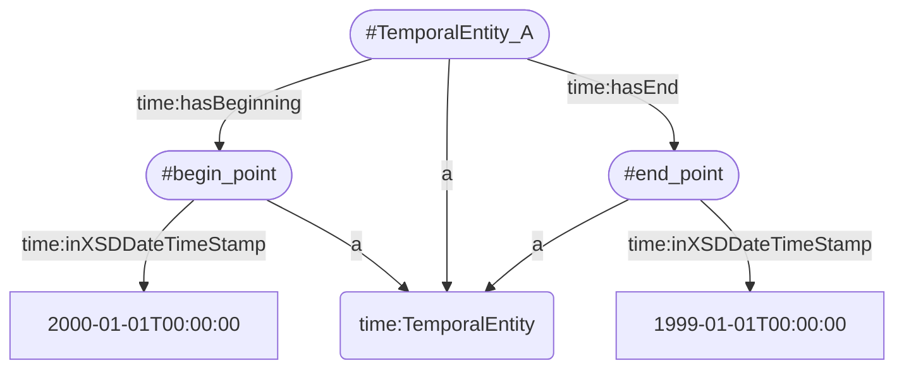
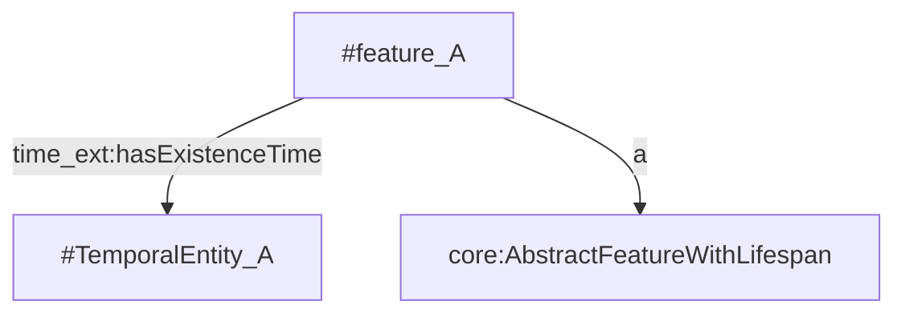

# SWRL Rule Test Suite
A proof of concept test suite for reasoning over RDF/OWL knowledge graphs with SWRL rules

- [SWRL Rule Test Suite](#swrl-rule-test-suite)
  - [Transformation UML Activity Diagram](#transformation-uml-activity-diagram)
  - [Proposed Rules and Test Data](#proposed-rules-and-test-data)
    - [Proposed Rules](#proposed-rules)
    - [Tests](#tests)
  - [Before running](#before-running)
    - [Rule and Test configuration](#rule-and-test-configuration)
    - [Data Preparation](#data-preparation)
  - [How to run](#how-to-run)
    - [Dependencies](#dependencies)
    - [To download](#to-download)
    - [To Run](#to-run)


## Transformation UML Activity Diagram


## Proposed Rules and Test Data
This directory contains two proposed SWRL rule sets and several corresponding tests and test ontology individuals.
### Proposed Rules
The proposed rules are for validating temporal consistency of Workspace data according to:
> [1] J. Samuel, S. Servigne, and G. Gesquière, “Representation of concurrent points of view of urban changes for city models,” J Geogr Syst, vol. 22, no. 3, pp. 335–359, Jul. 2020, doi: 10.1007/s10109-020-00319-1.

This article details what composes a Workspace and how "versioned" urban data or can be structured and temporally ordered using UML and [Description Logic](https://en.wikipedia.org/wiki/Description_logic) (DL) rules. 

A subset of these rules have been rewritten in SWRL and adapted [here](./rules.json), for validating urban data according to [OWL-Time Temporal Entities](https://www.w3.org/TR/owl-time/#time:TemporalEntity) and the proposed OWL-Time extension, CityGML, and Workspace ontologies located [here](https://dataset-dl.liris.cnrs.fr/rdf-owl-urban-data-ontologies/Ontologies/).

A set of basic rules are declared to verify that temporal entities (as modeled below) from OWL-Time are temporally consistent.
For example to verify a temporal entity begins before it ends we use the rule:
```
time:TemporalEntity(?a), time:hasBeginning(?a, ?i1), time:Instant(?i1), time:inXSDDateTimeStamp(?i1, ?t1), time:hasEnd(?a, ?i2), time:Instant(?i2), time:inXSDDateTimeStamp(?i2, ?t2), greaterThan(?t1, ?t2) -> owl:Nothing(?a)
```
Which would infer that a temporal entity with descendant properties such as...:

would be of type `owl:Nothing` and therefore inconsistent.

This can also infer temporal properties from OWL-Time such as `time:before`, `time:after`, etc.

CityGML features can be compared using these basic rules according to [1] by using properties from the proposed OWL-Time extension which proposes two properties:
- `time_ext:hasExistenceTime` for denoting a temporal entity that represents when a feature exists in the real-world.
- `time_ext:hasTransactionTime` for denoting a temporal entity that represents when a feature was added or removed from a dataset.



Note that these rules are currently a work in progress and do not cover the Document CityGML ADE rules nor do yet not cover all of the DL Workspace rules  proposed in [1].
Additionally, these rules do not cover the subsumption DL rules proposed in [1] as they would be defined by the use of `rdfs:subClassOf` axioms in their respective ontologies.

To add these properties to a CityGML city model and its features that do not contain temporal data, a script is provided [here](../Transformations/utilities/README.md#addtimestamps).

### Tests
Two sets of tests are provided:
1. [tests.json](./tests.json) for testing the provided test datasets `test_x.rdf`
   - These datasets are also provided in the Turtle format for easier human readability
2. [workspace_tests.json](./workspace_tests.json) for testing the Gratte Ciel dataset located [here](../Datasets/GratteCiel_Workspace_2009_2018)

Note that these tests are currently written for features conformant to the CityGML 3.0 model. Tests for CityGML 2.0 are currently in progress.

## Before running
Some Helpful Documentation:
- [SWRL](https://www.w3.org/Submission/SWRL/)
- [OWLReady2 Rules](https://owlready2.readthedocs.io/en/latest/rule.html)

### Rule and Test configuration
First two JSON files must be declared to configure:
1. What rules will be used to inference new information? Which OWL ontologies (the data model or Tbox of a knowledge graph) define the classes and properties used to define these rules?
2. What data instances or individuals in the knowledge graph should be tested in a given test? What should each test return (true or false) ? Where should newly inferenced data be output?

The 1st JSON file for defining rules should be structured as follows:
```
{
    "ontologies": [], # a list of ontology location strings in the forms "file://..." or "http://..." containing the classes and properties used in the subsequent rules
    "prefixes": {               # prefixes used in the defined rules
        "string": "string",     # where the prefix and uri could be for example: "owl": "http://www.w3.org/2002/07/owl#"
    },
    "rules": [  # a list of objects for configuring rules formed as:
        {
            "ignore": "boolean",        # if set to true this rule will be ignored during testing
            "rule": "atom1(?a), atom2(?b) -> atom3(?a, ?b)"     # a SWRL rule; prefixes declared in the "prefixes" object will be replaced with their uri values
        },
    ]
}
```
For example: [./rules.json](./rules.json)

The 2nd JSON file for defining tests should be structured as follows:
```
[       # a list of objects for configuring tests where each test is an object formed as:
    {
        "ignore": "boolean",            # if set to true this test will be ignored during testing
        "ontologies": [], # a list of ontology location strings in the forms "file://..." or "http://..." containing the individuals to be reasoned upon in this test
        "output": {
            "namespace": "string",          # individuals starting with this  uri will be exported after a test; this should be the same uri as the individuals to be reasoned upon
            "filename": "string",           # the name of the output file to be exported to
            "expected-result": "boolean"    # the expected result of the test, true meaning passed and false meaning failed (or that an inconsitency was inferred)
        }
    },
]
```
For example: [./tests.json](./tests.json)

### Data Preparation
OWLReady2 (v0.39) can only import RDF data in RDF/XML, OWL/XML or NTriples format. To convert Turtle RDF files to XML/RDF we recommend the convenient [rdf-xmlify.py](../Transformations/utilities/rdf-xmlify.py) script.

## How to run
### Dependencies
- [Python 3](https://www.python.org/downloads/)
- Python Libraries:
  - [owlready2](https://pypi.org/project/Owlready2/)
  - [rdflib](https://pypi.org/project/rdflib/)

### To download
First clone this repository and move into the created directory
```bash
git clone git://github.com/VCityTeam/UD-Graph
cd UD-Graph
```

### To Run
Usage:
```
usage: swrl_rules.py [-h] rule_file test_file

positional arguments:
  rule_file   Declare the rule JSON file.
  test_file   Declare the test JSON file.

options:
  -h, --help  show this help message and exit
```
To execute the basic tests defined in this directory use the following command:
```
python swrl_rules.py rules.json tests.json
```